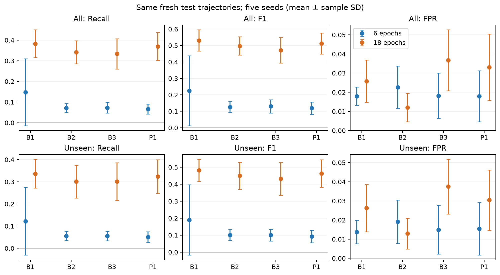

# 新規軌跡・6/18 epochs・5 seedsの追加比較

2026-09-14集計・検証完了。9月10日に固定した計画に沿って実行した。
元の6 epochs主解析を保持したまま、学習時間の効果とB3/P1の比較を新しい軌跡で確認した。

## 結論

18 epochsでは、同じ新規評価データで全方式の平均Recall/F1が6 epochsより上がった。
さらに18 epochs内では、P1がB3より平均Recall/F1を高め、平均FPRを下げた。
ただしB1は平均Recall/F1が最も高く、B2は平均FPRが最も低い。
P1の全方式に対する優越、統計的有意差、実運用での有効性までは主張しない。

## 新規unseen geometryでの主な結果

5 model seedsの平均（標準偏差と全体・施設・geometry別指標はリンク先CSV）：

| Epochs | 方法 | Recall | Precision | F1 | AUROC | FPR |
|---|---|---:|---:|---:|---:|---:|
| 6 | B1 | 0.123 | 0.710 | 0.190 | 0.721 | 0.014 |
| 6 | B2 | 0.056 | 0.610 | 0.101 | 0.669 | 0.019 |
| 6 | B3 | 0.055 | 0.673 | 0.100 | 0.669 | 0.015 |
| 6 | P1 | 0.051 | 0.658 | 0.093 | 0.669 | 0.015 |
| 18 | B1 | 0.337 | 0.869 | 0.482 | 0.869 | 0.026 |
| 18 | B2 | 0.301 | 0.926 | 0.449 | 0.866 | 0.013 |
| 18 | B3 | 0.301 | 0.798 | 0.432 | 0.866 | 0.037 |
| 18 | P1 | 0.323 | 0.843 | 0.463 | 0.866 | 0.030 |

18 epochsのunseenにおけるP1−B3の対応差は、Recall +0.0225、F1 +0.0312、FPR −0.0071。
Recall/F1は4 seedsで増加し1 seedで低下、FPRは全5 seedsで低下した。
全体の対応差はRecall約+0.036、F1約+0.041、FPR約−0.004。
6 epochsの新規評価ではP1の平均Recall/F1はB3より低く、元の主解析の否定的な結果も残る。



図の誤差棒は標本標準偏差で、信頼区間ではない。平均−標準偏差が負になる場合も省略せず表示する。

## 学習時間の効果とP1の効果を区別する

同じ新規unseenデータ上で、B2の6→18 epochsはRecall 0.056→0.301、F1 0.101→0.449、
AUROC 0.669→0.866となった。この大きな改善はCNNの学習時間の変更に伴うものであり、P1の効果とはしない。
P1の追加効果は、18 epochsで同じB2 scoreを使うB3との対応比較で評価する。

学習窓・初期化・最初の6 epochsの損失が一致することを検証した。
6 epochsのモデルは元checkpointを追加学習せず再評価し、18 epochsは同じ学習条件で学習時間だけ延ばした。
新旧で同じ評価データを使っているため、異なるtest同士の単純な前後比較にはしていない。

## 残る限界

- 同じcalibration FPR予算0.05でもtest FPRは一致しない。18 epochsでP1/B3のRecallが上がる際、6 epochsよりFPRも高い。
- 18 epochsのP1はB2よりRecall/F1が高いがFPRも高く、B1よりRecall/F1が低い。単一の最良方式は主張できない。
- 評価軌跡は新しいが、geometryは以前の研究で調べたものを含む。実測データは使用していない。
- 5 seedsは固定軌跡上のモデル乱数の反復であり、独立した5データセットではない。
- 正例率1/3の指定時点評価。自然頻度の連続監視・event recall・検知遅延・FLは未検証。
- 18 epochsは開発評価を踏まえた追加条件。初期結果を上書きして新たな主解析だけを提示することはしない。

## 成果物・検証・再現

- [実行前の計画](FRESH_TRAJECTORY_COMPARISON.md)
- [全体・unseen表と対応差](../results/fresh_trajectory_comparison/REPORT.md)
- [6 epochsの施設・geometry別CSV](../results/fresh_trajectory_comparison/epochs6/summary.csv)
- [18 epochsの施設・geometry別CSV](../results/fresh_trajectory_comparison/epochs18/summary.csv)
- [18−6 epochsの対応差CSV](../results/fresh_trajectory_comparison/paired_epochs18_minus_6_summary.csv)
- 各epochディレクトリにP1−B3のseed別差と平均・標準偏差、圧縮score、監査JSONを保存。

20 checkpoints、1,240行のgroup混同行列、各checkpoint 16 calibration窓の実推論、
同一入力・学習選択・6 epochsまでの損失一致を検証した。比較図を表示確認し、47 testsが成功した。

```powershell
.\fl_env\Scripts\python.exe experiments/run_simulated_fall_p1_v2.py --config configs/simulated_fall_p1_v2_fresh18.json --output-dir results/local_simulated_fall_p1_v2_fresh18 --resume
.\fl_env\Scripts\python.exe experiments/report_fresh_trajectory_comparison.py
.\fl_env\Scripts\python.exe experiments/plot_fresh_comparison.py
```

新規実行では最初のコマンドの`--resume`を外す。データ準備後、元の6 epochs checkpointがある状態で
`experiments/evaluate_original_cnn_on_fresh_trajectories.py`を一度実行すると、対応する6 epochsの新規評価を生成する。
既存の6 epochs新規評価出力がある場合は再実行しない。大きなcacheとcheckpointはローカル保持。
元環境の再現と固定条件推定器については[再現手順](OPERATING_POINT_REVIEW.md)を参照。

論文では、初期比較、学習時間の開発検証、新規軌跡での追加比較を順に記載する。
主張の候補は「評価した条件では、検出器の学習時間によって条件適応thresholdの効果が異なった」。
結果の範囲を広げた一般化や、推定器だけで大幅改善したという説明は避ける。
