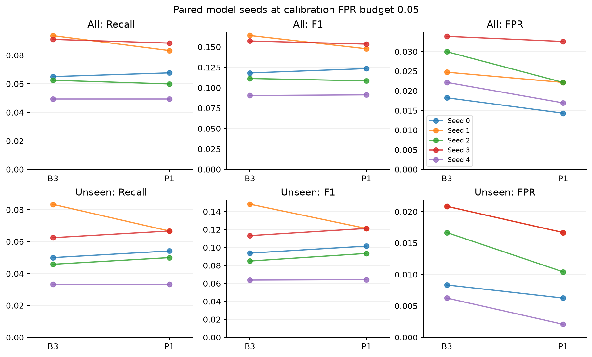
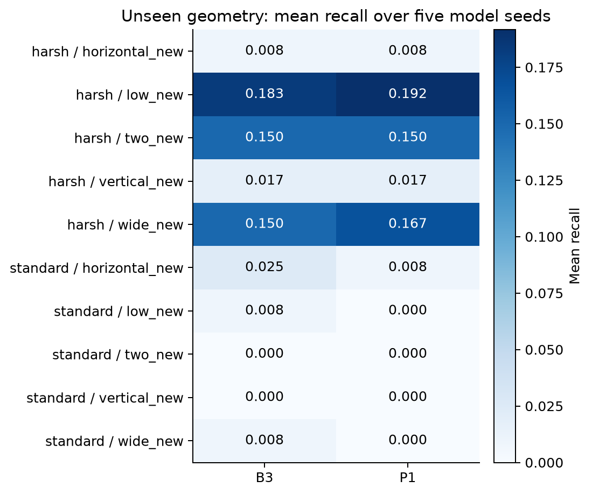
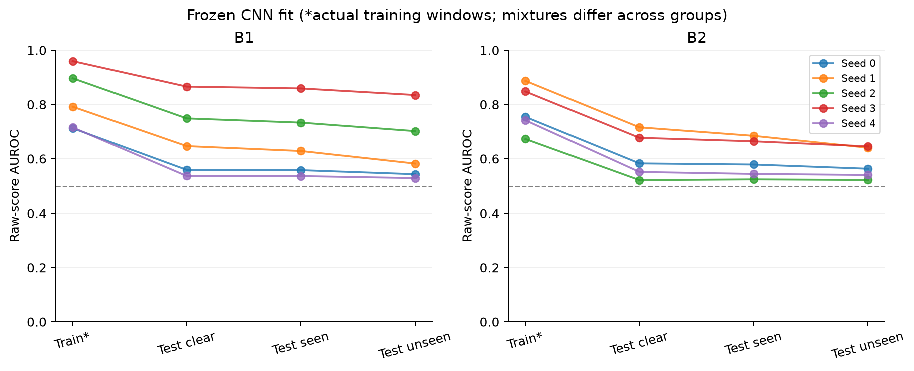

# Figures and frozen-model diagnosis — 2026-09-09

All figures are descriptive analyses of the existing five model seeds. No retraining or changes to the main threshold calibration were made. PNG files are for review; SVG files preserve vector graphics for manuscript layout.

## Paired policies



**Caption.** Recall, F1 and false-positive rate for B3 and P1 across five paired model seeds, at the main calibration FPR budget of 0.05. Each line connects the same model seed. The upper row pools all test geometries; the lower row contains held-out geometries. Seeds share trajectories. Lower FPR is favorable, whereas higher recall and F1 are favorable. Equal calibration budgets do not imply equal test FPR. Source: `results/simulated_fall_p1_v2/metrics.csv`.

## Unseen geometry



**Caption.** Mean recall across five model seeds for each facility and held-out geometry. B3 and P1 use identical CNN scores. Cells with zero or very low recall remain and must not be hidden by aggregate results. Facility differences combine noise, trajectory and calibration effects; they do not isolate a causal effect of noise. Source: `results/simulated_fall_p1_v2/summary.csv`.

## Frozen CNN fit



**Caption.** Raw-score AUROC of each frozen CNN on its actual training windows and test subsets. B1 training uses clear inputs; B2 training uses sampled known geometries. The distributions and sample counts differ across columns, so the lines are a descriptive comparison, not a controlled estimate of the effect of geometry alone. The dashed line marks AUROC 0.5. Source: `results/cnn_fit_v2/metrics.csv`.

## 診断で分かったこと

| CNN | 学習AUROC | Test clear | Test seen | Test unseen |
|---|---:|---:|---:|---:|
| B1 | 0.815±0.110 | 0.671±0.137 | 0.663±0.134 | 0.638±0.129 |
| B2 | 0.781±0.086 | 0.610±0.083 | 0.599±0.072 | 0.582±0.058 |

いずれも5 model seedsの平均±標本標準偏差。学習窓では一定の識別ができる一方、
既知条件の別軌跡でもAUROCが低い。したがって低Recallをunseen geometryだけの問題とは扱えない。
B2のtrain→test seenの差は約0.182、test seen→unseenの差は約0.017である。
前者には学習データと評価データの構成の違いも含むため、差を単一原因へ帰属しない。

学習AUROCもseedごとにばらつき、学習窓を完全に分類できるわけではない。
最適化不足、表現の制約、訓練データへの適合などの因果的な切り分けは未実施である。
この診断だけを理由にepochsやthresholdを変更したり、良いseedを選んだりしていない。

次の追加実験を行うなら、既存CNNの学習安定性と別軌跡への汎化を開発用データで先に確認する。
設定を固定してから新たな評価軌跡でB1〜P1を比較し、現主解析を置き換えず併記する。
現時点では追加学習を開始せず、比較結果・診断・原稿の材料を整えた。

## Reproduction

```powershell
.\fl_env\Scripts\python.exe experiments/diagnose_simulated_fall_v2.py
.\fl_env\Scripts\python.exe experiments/plot_paper_results.py
```

The diagnosis requires the local original observation cache and ten checkpoints, and verifies their recorded hashes and calibration-score reproduction. The plots require NumPy and Matplotlib (generated with Matplotlib 3.11.1) and the saved CSVs. All three PNGs were visually checked for legibility and clipping. The original comparison tables are checked against their published hashes before plotting.
