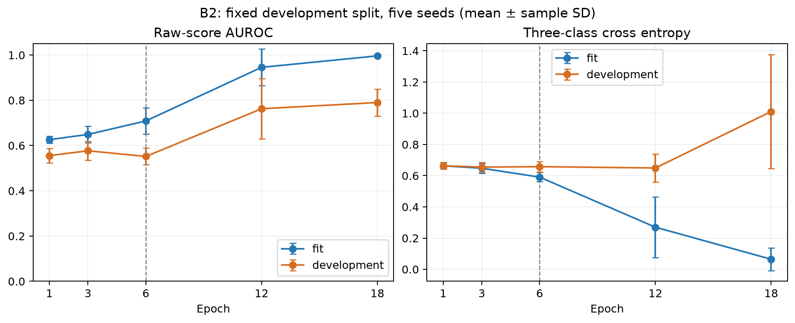

# B2 training duration: development-only check

Five model seeds; fit records 10001–10003, development record 10004 in each facility.
The primary comparison was fixed as 18 minus 6 epochs before execution. No calibration/test evaluation or best-epoch selection.

| Scope | Epoch | AUROC mean ± SD | Cross entropy mean ± SD |
|---|---|---|---|
| fit | 1 | 0.6261 ± 0.0158 | 0.6632 ± 0.0212 |
| fit | 3 | 0.6491 ± 0.0373 | 0.6477 ± 0.0332 |
| fit | 6 | 0.7088 ± 0.0581 | 0.5908 ± 0.0290 |
| fit | 12 | 0.9458 ± 0.0814 | 0.2700 ± 0.1956 |
| fit | 18 | 0.9964 ± 0.0065 | 0.0645 ± 0.0721 |
| development | 1 | 0.5555 ± 0.0312 | 0.6639 ± 0.0212 |
| development | 3 | 0.5769 ± 0.0414 | 0.6548 ± 0.0301 |
| development | 6 | 0.5519 ± 0.0366 | 0.6578 ± 0.0328 |
| development | 12 | 0.7628 ± 0.1323 | 0.6494 ± 0.0895 |
| development | 18 | 0.7901 ± 0.0597 | 1.0108 ± 0.3654 |

## Paired epoch 18 minus epoch 6

| Scope | AUROC difference | Cross entropy difference |
|---|---|---|
| fit | +0.2876 ± 0.0542 | -0.5263 ± 0.0560 |
| development | +0.2382 ± 0.0637 | +0.3531 ± 0.3573 |

AUROC: higher is better. Cross entropy: lower is better. Standard deviations describe model seeds, not independent data replications.
This smaller fit partition is not directly comparable with the original full-training 6-epoch experiment.
No threshold policy or condition estimator was altered, and these are not new B3/P1 test results.

Verified: recorded producer hashes, all ten checkpoint hashes, all 50 exported metric rows and all paired differences.

